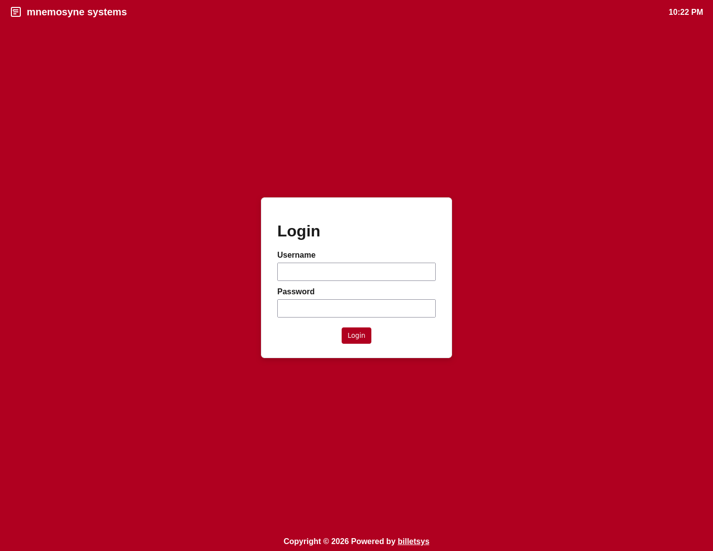

\newpage

# Introduction

[**billetsys**](https://github.com/mnemosyne-systems/billetsys) is a support ticket system for organizations that need a shared view of customer issues, internal follow-up, and support delivery.

The application is organized around the lifecycle of a ticket. A user can create a ticket, describe the problem, add follow-up messages, and attach files. Support staff can assign ownership, track progress, update status, and connect the ticket to product versions, entitlements, categories, and external issue trackers.

## Roles

The interface is adapted for the main roles that participate in support work.

* **Users** can create and follow their own tickets.
* **Superusers** can view and manage tickets for a broader customer scope.
* **TAMs** can monitor ticket progress and customer activity.
* **Support** can work the queue, update tickets, and reply with attachments.
* **Admins** can manage application data and operational settings.

## Ticket handling

Each ticket keeps the core information needed to handle a case:

* Requester and company
* Status and assignment
* Related entitlement and support level
* Affected and resolved product versions
* Category and external issue reference
* Conversation history and attachments

This makes it possible to follow a case from the first report through investigation and final resolution.

## Communication

Communication in **billetsys** is centered on message threads connected to each ticket. Replies become part of the ticket history so the customer-facing discussion and the internal support workflow stay tied to the same record.

The system also includes email integration so incoming mail can create or update tickets, and outgoing notifications can keep the right participants informed when status or message activity changes.

## Knowledge and reporting

In addition to ticket handling, **billetsys** includes article support for knowledge sharing and administrative areas for managing users, companies, entitlements, versions, countries, time zones, and related reference data.

The result is a single application for customer support intake, triage, communication, documentation, and operational oversight.
