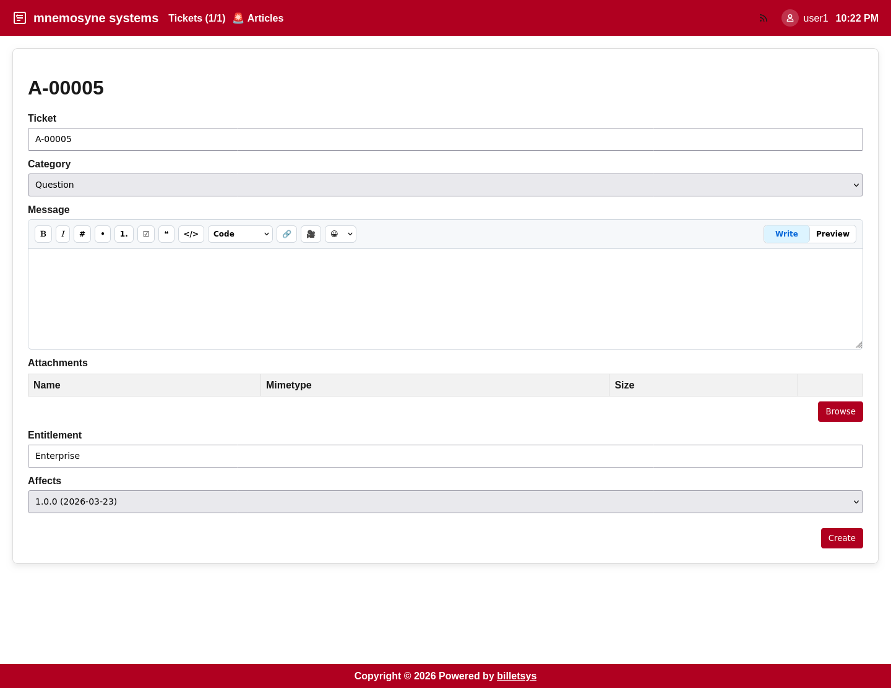

\newpage

# Getting started

This chapter describes how to prepare a local development setup for [**billetsys**](https://github.com/mnemosyne-systems/billetsys) using PostgreSQL and how to start the application in development mode.



## Requirements

Before you begin, make sure the following tools are available:

* [Java](https://openjdk.org/) 25
* [Maven](https://maven.apache.org/)
* [PostgreSQL](https://www.postgresql.org/)
* [Git](https://git-scm.com/)

## PostgreSQL setup

The default local configuration expects a PostgreSQL database named `ticketdb` and a database user with username `ticketdb` and password `ticketdb`.

Create the user and database in PostgreSQL:

```sh
createuser -P ticketdb
createdb -E UTF8 -O ticketdb ticketdb
```

If you already have an existing local database and want to recreate it from scratch, you can do:

```sh
dropdb ticketdb
createdb -E UTF8 -O ticketdb ticketdb
```

The application connects to PostgreSQL on `localhost:5432` by default. These defaults can be changed through environment variables such as `DB_HOST` and `DB_PORT` if needed.

## Get the source code

Clone the repository and enter the project directory:

```sh
git clone https://github.com/mnemosyne-systems/billetsys.git
cd billetsys
```

## Start billetsys

Start the application in Quarkus development mode:

```sh
mvn clean quarkus:dev
```

On startup, billetsys will connect to PostgreSQL, update the schema, and load bootstrap data.

The application listens on:

* `Http://localhost:8080`
* `Https://localhost:8443`

## First login

The seeded development users include the following accounts:

* User: `user1` / `user1`
* User: `user2` / `user2`
* User: `userb` / `userb`
* Superuser: `superuser1` / `superuser1`
* Superuser: `superuser2` / `superuser2`
* TAM: `tam1` / `tam1`
* TAM: `tam2` / `tam2`
* Support: `support1` / `support1`
* Support: `support2` / `support2`
* Admin: `admin` / `admin`

## Notes

In development mode, billetsys uses mocked outgoing email by default, which makes it easier to test notification flows without configuring a real mail server.
