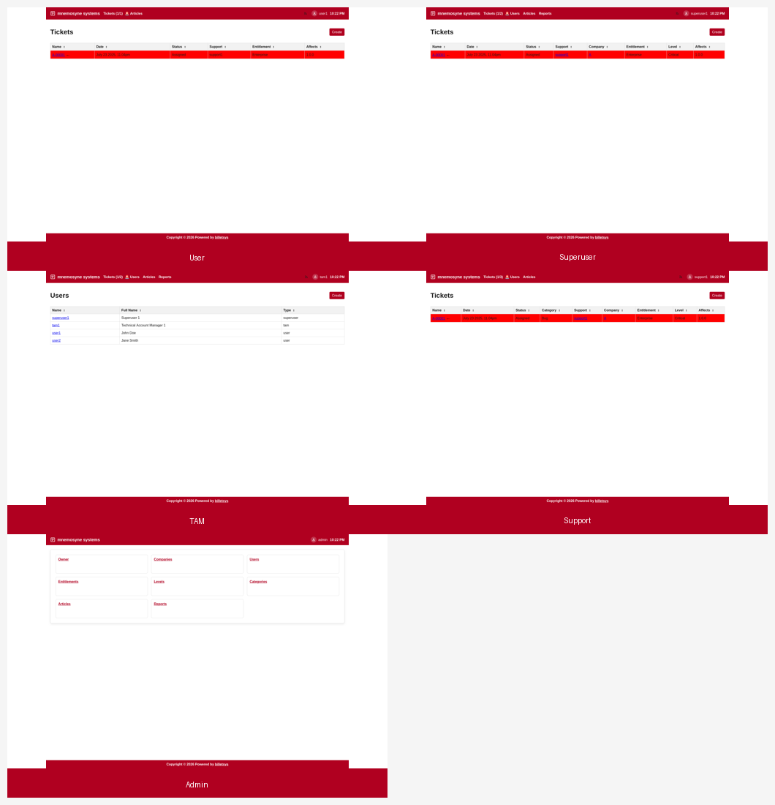

\newpage

# Roles

[**billetsys**](https://github.com/mnemosyne-systems/billetsys) is designed around a small set of roles with different responsibilities and different views of the same support process.

The role model separates customer-facing work from operational support work and system administration. This helps keep each screen focused on the information and actions that matter for that role.

## User

The **User** role is the standard customer-facing role. Users can create tickets, follow progress, exchange messages with support, and review their own ticket history.

## Superuser

The **Superuser** role is a customer-side power user. Superusers can work across a broader company scope than a normal user and help coordinate tickets and users for their organization.

## TAM

The **TAM** role represents the Technical Account Manager. A TAM follows customer activity closely, creates and tracks tickets, works across assigned companies, and has broader visibility than an ordinary user.

## Support

The **Support** role is used by the support team handling incoming work. Support users manage ticket queues, update assignments, reply to customers, and keep cases moving toward resolution.

## Admin

The **Admin** role manages the system itself. Admins maintain companies, users, service definitions, categories, entitlements, and other reference data used throughout the application.

## Shared model

All roles work with the same core ticket model:

* Tickets
* Messages
* Attachments
* Assignments
* Status
* Company context
* Entitlement and version information

What changes from role to role is the depth of access, the available actions, and the scope of data that can be managed.

The following chapters describe each role in more detail.
