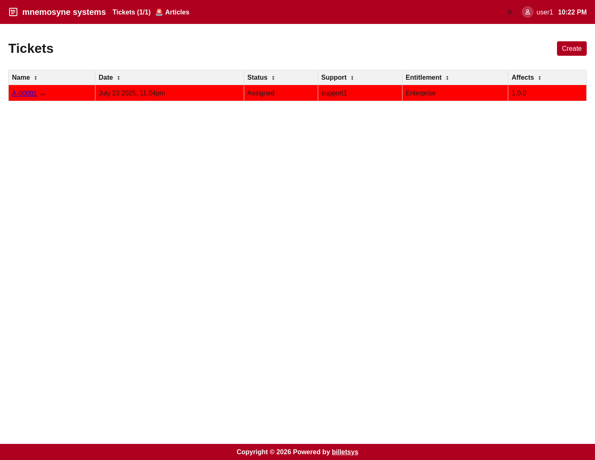

\newpage

# User

The **User** role is intended for the people who report issues and follow their own support cases.

## Main purpose

Users interact with billetsys from the customer side. Their primary tasks are to open tickets, describe problems clearly, add follow-up information, and monitor replies from support.

## Typical workflow

A user will normally:

* Create a new ticket
* Choose the relevant company context
* Select category, entitlement, and version information when available
* Describe the problem
* Add follow-up messages
* Upload attachments
* Review status changes until the ticket is resolved

This gives the user a single place to follow the full history of a case from report to resolution.

## Ticket access

Users mainly work with their own tickets. They can open ticket lists, review details, and continue the conversation by posting new messages.

The ticket pages present the information needed to understand the case:

* Current status
* Requester
* Category
* Affected and resolved versions
* External issue reference when one is present
* Message history
* Attached files

## Communication

The user role is centered on communication. Instead of managing assignments or administration data, users primarily interact through the message thread on each ticket.

This keeps the support dialogue connected directly to the case record and makes it easier to understand how the issue developed over time.

## Profile management

Users can maintain their own profile information and password. This helps keep contact details current so notifications and follow-up communication work as expected.

## Boundaries

Users do not manage the system and do not act as support staff. In practice this means that a normal user does not:

* Administer companies or users globally
* Manage service levels or entitlements
* Assign support personnel
* Access system-wide reporting

The user experience is intentionally focused on reporting issues and following existing cases.
