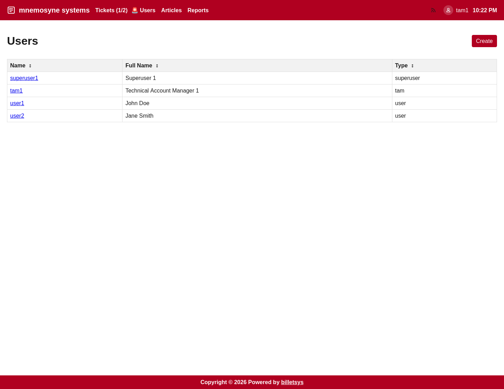

\newpage

# TAM

The **TAM** role represents the Technical Account Manager.

## Main purpose

A TAM works close to the customer relationship and follows support activity across assigned companies. This role combines customer awareness with broader operational insight than a normal user.

## How the role fits in

The TAM sits between ordinary customer usage and internal support handling. A TAM needs enough access to understand ongoing issues, help create and track tickets, and review customer activity at a broader level.

## Ticket workflow

A TAM can participate actively in ticket handling by:

* Creating tickets
* Reviewing tickets across the assigned company scope
* Opening ticket details
* Replying in message threads
* Following status progress from open work to completed work

This supports a more hands-on account management workflow where the TAM can help keep issues moving and communicate clearly with both customer contacts and support staff.

## Company awareness

The role is designed around assigned companies. This means a TAM can follow patterns, recurring issues, and current workload within the accounts they are responsible for.

## Reporting and follow-up

A TAM can use reporting views to understand overall support activity for the relevant customers. This helps identify trends, ticket volume, and case development over time.

## Knowledge sharing

Compared with ordinary users, the TAM role has a broader collaboration focus. It can participate more directly in knowledge-oriented workflows and internal follow-up around customer issues.

## Boundaries

The TAM role is not the same as support and not the same as admin. A TAM helps coordinate and monitor work, but does not own the full platform configuration.

Typical boundaries include not being responsible for:

* Global system administration
* Master-data configuration
* Full support queue ownership
* Company-independent operational control

The TAM role is therefore best viewed as an account-focused coordination and oversight role.
