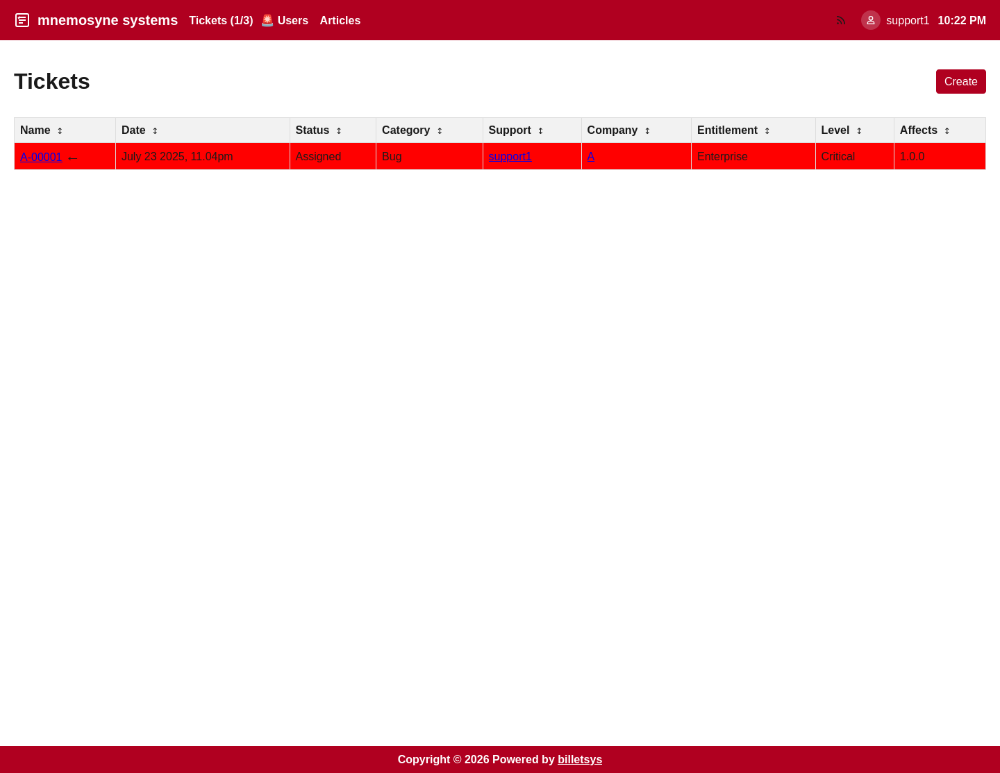

\newpage

# Support

The **Support** role is used by the people who actively process tickets and communicate with customers during investigation and resolution.

## Main purpose

Support users operate the working queue of the system. They turn incoming requests into managed cases, keep assignments current, reply to customers, and drive tickets toward a resolution.

## Ticket operations

Support has the deepest ticket workflow in the application. Typical activities include:

* Creating tickets on behalf of customers
* Reviewing open, assigned, and closed tickets
* Editing ticket metadata
* Assigning tickets to support personnel
* Tracking TAM involvement
* Replying with messages
* Working with attachments
* Closing resolved cases

This makes the support area the operational center of billetsys.

## Queue management

Support users need broad visibility across tickets so they can understand backlog, ownership, and active work. The support views are therefore organized around queue handling and fast navigation between tickets and related users.

## Communication

The support role uses the message thread heavily. Support staff can reply directly inside the ticket, keep the conversation history together, and include attachments when needed.

Because communication is tied to ticket activity, the case history becomes the shared source of truth for both the customer side and the support side.

## User and company context

Support users also need supporting context around the ticket. They can inspect related users and companies to understand who is involved, what customer organization is affected, and how the case fits into the broader account relationship.

## Knowledge contribution

Support work often produces reusable knowledge. For that reason, the support role can participate in article-oriented workflows that help capture solutions and share them more broadly.

## Boundaries

Support has broad operational access, but it is still different from full administration. Support normally works with live cases and related users rather than owning all system configuration.

That means the support role is not primarily responsible for maintaining:

* Global categories
* Support level definitions
* Entitlement master data
* Full company administration

Support is therefore the main execution role for ticket handling, but not the top-level configuration role.
