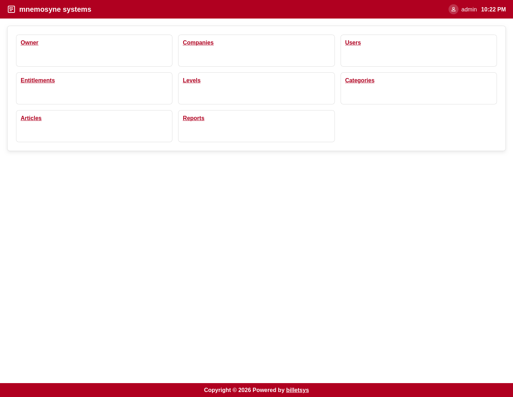

\newpage

# Admin

The **Admin** role is responsible for maintaining the application and the data structures that the rest of billetsys depends on.

## Main purpose

Admins keep the system ready for day-to-day support work. They manage the reference data, organizational data, and user setup that define how tickets can be created and handled.

## Administrative scope

The admin role covers the broadest set of management tasks in billetsys, including:

* Companies
* Users
* Categories
* Entitlements
* Levels
* Related reference data
* Knowledge content

Because these data sets affect many parts of the application, admin work shapes how the rest of the roles experience billetsys.

## Company and user administration

Admins manage the organizational model of the system. This includes creating and updating companies, maintaining user accounts, and making sure the right people have the right role assignments.

This is important because ticket visibility, responsibility, and coordination all depend on correct company and user data.

## Service structure

Admins also maintain the support structure behind the ticketing process. Categories, entitlement information, and levels help define how tickets are classified and how service expectations are represented in the system.

Admins also maintain installation branding. The Installation entity stores the shared logo, optional login background image, a header clock format toggle (12-hour or 24-hour), and three dedicated branding colors for Header/Footer, Headers, and Buttons so the same branding can be shown consistently across the application.

The branding controls are available on the Owner edit screen. Between the Background and Colors sections, admins can use the slider-style clock toggle to decide whether the header clock is shown as `2:43pm` or `14:43` throughout the application.

## Oversight and reporting

The admin role has the broadest reporting perspective. Admin users can review the system at a global level and use that visibility to understand overall workload, trends, and organizational activity.

## Knowledge and governance

Admins also contribute to governance and consistency. By managing shared structures and content, they help ensure that the platform stays coherent as companies, users, and tickets grow over time.

## Boundaries

Although admins have the broadest access, the role is still part of the same application model. Admin work should generally focus on configuration, oversight, and enablement rather than replacing the day-to-day workflow of support agents.

The admin role is therefore best seen as the stewardship role for billetsys as a whole.
