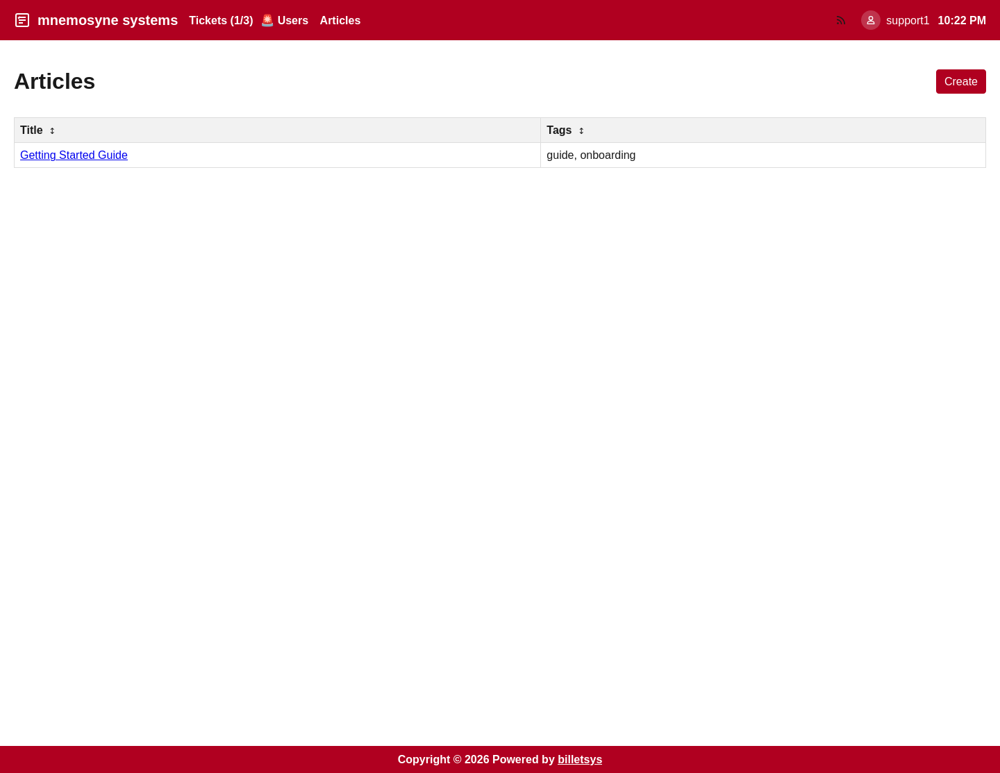

\newpage

# Articles

The **Articles** area in billetsys provides a shared knowledge base for solutions, guides, and reusable support information.

## Purpose

Not every answer should stay locked inside a ticket conversation. The articles feature makes it possible to capture useful knowledge in a form that can be reused by other users and teams.

This helps billetsys support both reactive support work and longer-term knowledge sharing.

## Typical content

Articles can be used for:

* Getting started guides
* Workaround descriptions
* Troubleshooting instructions
* Operational notes
* Reusable solution patterns

This makes the knowledge base a useful complement to ticket handling.

## Reading articles

Articles can be browsed and opened from the shared article area. The goal is to make support knowledge available without requiring users to search through ticket histories.

For readers, the article pages provide:

* Title
* Tags
* Formatted body content
* Linked attachments when present

## Writing articles

Billetsys supports article creation and editing for the roles that contribute directly to solution development and knowledge capture.

Article editing is designed for practical support documentation. Content can be written in a structured text format and enriched with attachments when supporting files are needed.

## Knowledge workflow

The article area works well as the next step after ticket resolution:

* A recurring issue is identified
* The solution is stabilized
* The result is written up as an article
* Future users and staff can reuse that information

This helps reduce repeated work and improves consistency in support responses.

## Role perspective

The article area is shared, but not all roles participate in the same way.

In general:

* All authenticated users can benefit from reading shared knowledge
* Support-oriented roles can contribute and improve articles
* Administrative roles can oversee and manage the knowledge base more broadly

This keeps article publishing aligned with operational responsibility.

## Attachments and formatting

Articles support richer content than a plain note. They can include structured text and file attachments, which makes them useful for step-by-step guides, examples, and reference material.

## Why it matters

The articles feature turns day-to-day support experience into reusable organizational knowledge. Over time, that helps billetsys serve not only as a ticket system, but also as a knowledge platform for support teams and customers.
