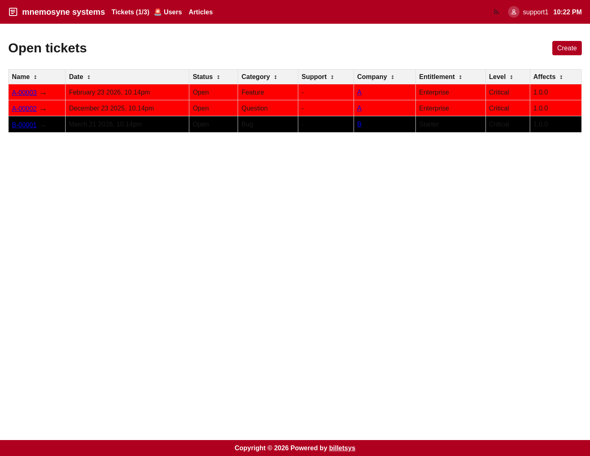

\newpage

# Tickets

The **Ticket** is the central object in billetsys. It represents a support case from the first report through investigation, communication, and final resolution.

## Purpose

Tickets bring together the information needed to manage a case in one place. Instead of splitting status, ownership, communication, and attachments across different tools, billetsys keeps them connected to the same record.

## Core information

A ticket can hold the main context for a support issue, including:

* Ticket identifier
* Ticket title
* Company
* Requester
* Status
* Category
* Entitlement
* Affected and resolved versions
* Support and TAM assignments
* External issue reference
* Message history

This allows teams to understand both the current state of a case and how it reached that state.

The entity model stores the ticket identifier and the ticket title separately. The identifier is the generated case reference used for routing, exports, and cross-system references, while the title is the human-written summary entered when the ticket is created.

## Lifecycle

Tickets move through a lifecycle that begins when an issue is reported and ends when the case is resolved and closed.

A typical flow looks like this:

* A ticket is created
* The ticket is reviewed and assigned
* Support and customer communication continues in the message thread
* Status changes reflect current progress
* A resolved case is eventually closed

This lifecycle gives both customer-facing roles and operational roles a shared view of progress.

## Status and ownership

Status is one of the most important parts of the ticket workflow. It helps users understand whether a case is waiting for action, already assigned, actively being worked on, or completed.

Ownership matters just as much. Support assignments and TAM involvement make it clear who is currently responsible for handling the case and who is following the customer relationship.

## Ticket lists

Billetsys provides ticket lists that help each role focus on the cases relevant to them. Depending on role, the interface can emphasize:

* Personal tickets
* Company-scoped tickets
* Assigned work
* Open work
* Closed work

This makes the ticket area useful both for individual follow-up and for operational queue management.

## Ticket search

Ticket lists also include a search control in the main application header. The search is opened from the search icon shown before the RSS feed icon.

Once the search field is open, users can type a search term and press `Enter` to filter the current ticket queue.

When the entered text matches ticket identifiers or ticket titles, the search also offers autocomplete suggestions. For example, typing `A-` can suggest a ticket such as `A-00001`.

The search currently matches:

* Ticket identifier
* Visible ticket message content

This makes it possible to find a case either by its ticket number or by text that appeared in the conversation history.

For private messages, search only matches message content that is visible to the current user role.

Search is queue-aware. For example, when a user searches from the open tickets view, the result only includes matches from that open ticket list. The same behavior applies to assigned and closed ticket queues.

## Detail view

The ticket detail page is where the full case comes together. It combines the current ticket data with the full conversation history, attached files, assignments, and related references.

This page is the main working area for understanding a case in context.

Cross-references from other tickets that mention this ticket are shown in a dedicated Related section in the ticket header.

## External tracking

Tickets can also include an external issue reference. This makes it easier to connect billetsys with development or defect tracking workflows outside the ticket system itself.

## Export

Billetsys supports exporting tickets so that a case can be shared, archived, or reviewed outside the live application. This is useful when teams need a portable version of the case record.

## Role perspective

All roles interact with tickets, but not in the same way.

In general:

* Users follow the cases they reported
* Superusers coordinate tickets within their broader company scope
* TAMs monitor and follow ticket activity across assigned accounts
* Support staff actively work and update tickets
* Admins oversee the structures behind the ticket process

This shared but role-aware design is what makes the ticket model the center of billetsys.
