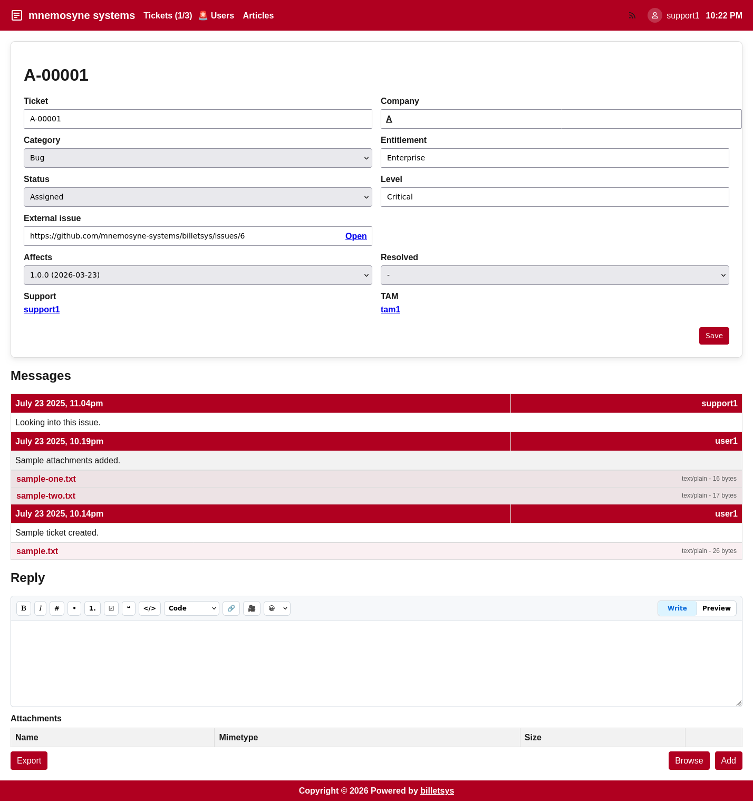

\newpage

# Messages

The **Messages** area of billetsys captures the conversation that happens around a ticket.

## Purpose

A ticket by itself is only a container for case information. Messages provide the ongoing dialogue that explains what was reported, what was investigated, what changed, and what was finally done.

Because messages are tied directly to tickets, billetsys keeps the communication history and the case record together.

## Conversation model

Each message belongs to a specific ticket and becomes part of that ticket's history. Over time, the message thread shows how the case developed from the initial report to the final outcome.

This makes the thread valuable not only for communication, but also for auditability and knowledge transfer.

Messages are **public by default**. When writing a message, the sender can switch **Public** off to create a private message instead.

Private messages are only visible within the matching role group:

* Messages written by **Support** or **TAM** are private to **Support and TAM**
* Messages written by **User** or **Superuser** are private to **User and Superuser**

Private messages are clearly marked with **(Private)** in the message header.

## Typical message content

Messages can be used for:

* Problem descriptions
* Follow-up questions
* Investigation updates
* Solution details
* Closure notes

This helps the ticket history reflect the real work that happened on the case.

## Attachments

Messages can include attachments when files are needed to explain or document an issue. This is useful for logs, screenshots, reports, exports, and other supporting material.

By keeping attachments inside the message flow, billetsys ensures that evidence and discussion stay connected.

## Ticket mentions

Messages support ticket cross-references using the `#` mention syntax. Typing `#` followed by a ticket identifier in the message editor opens a suggestion list. Selecting a ticket inserts a mention that links to the referenced ticket.

Mentions create a cross-reference record. Referenced tickets appear in a dedicated Related section, and inline mentions in messages show a hover preview.

## Communication flow

The message thread supports a continuous support conversation:

* A requester reports an issue
* Support or another responsible role replies
* More detail is added over time
* Status changes and message updates together show progress

This makes the thread the practical heartbeat of a ticket.

Public and private messages can exist in the same thread. This lets billetsys support normal customer-visible communication while still allowing group-limited follow-up when needed.

## Notifications

Message activity can also trigger notifications so that relevant participants stay informed when a conversation changes. This helps billetsys work not only as a web application, but also as part of a broader support communication flow.

Private message email notifications follow the same audience split as the thread itself:

* Private messages from **Support** or **TAM** are emailed only to the **Support/TAM** group
* Private messages from **User** or **Superuser** are emailed only to the **User/Superuser** group

## Email integration

Billetsys supports communication patterns where ticket conversations interact with email-based workflows. This helps teams continue case discussions while keeping the ticket history synchronized with the main support record.

## Reading the thread

When a user opens a ticket, the message history helps answer key questions:

* What was originally reported
* What support has already investigated
* What information is still missing
* What files have been shared
* Why the ticket has its current status

This makes message history one of the most important parts of understanding a case.

Users only see the messages that are visible to their role group, so the thread view reflects the correct conversation scope for that reader.

## Role perspective

Different roles participate in message threads in different ways.

In general:

* Users use messages to report and clarify problems
* Support uses messages to investigate, respond, and document work
* TAMs and superusers use messages to follow and coordinate broader case activity

The result is a shared conversation space that supports both customer communication and internal operational follow-up.
