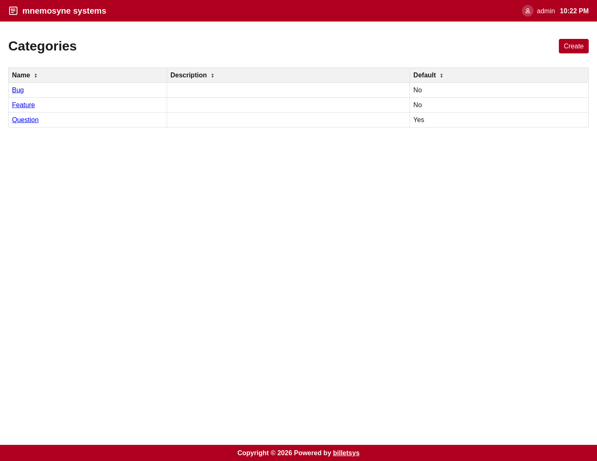

\newpage

# Categories

The **Categories** feature helps billetsys classify tickets by the kind of issue they represent.

## Purpose

Not all tickets mean the same thing. Categories give structure to incoming work by labeling tickets in a way that helps users and support staff understand what kind of case they are looking at.

This makes categories useful for both day-to-day handling and later reporting.

## Ticket classification

When a ticket is assigned to a category, that category becomes part of the case context. It helps make the ticket easier to understand and easier to compare with similar work.

Categories can be used to reflect common kinds of support activity, such as:

* Product issues
* Usage questions
* Setup problems
* Requests
* Follow-up work

The exact meaning depends on how billetsys is configured for the organization.

## Default behavior

Categories are also useful because they provide a default classification model for tickets. This helps keep ticket creation consistent even when users do not actively think about classification at the moment they report an issue.

## Operational value

Over time, categories help teams answer questions such as:

* What kinds of issues are arriving most often
* Which work types take the most effort
* How support demand is distributed

This means categories are not just labels on individual tickets. They also support better analysis and planning.

## Description and context

In addition to a name, categories can carry richer descriptive context. This makes them useful as maintained reference items rather than simple tags.

That context can help administrators keep the classification system understandable as the support operation grows.

## Role perspective

Categories are mostly maintained by administrative roles, but they affect many other parts of the application. Users, support staff, TAMs, and superusers all benefit from clearer ticket classification even if they are not the ones managing the category definitions directly.
