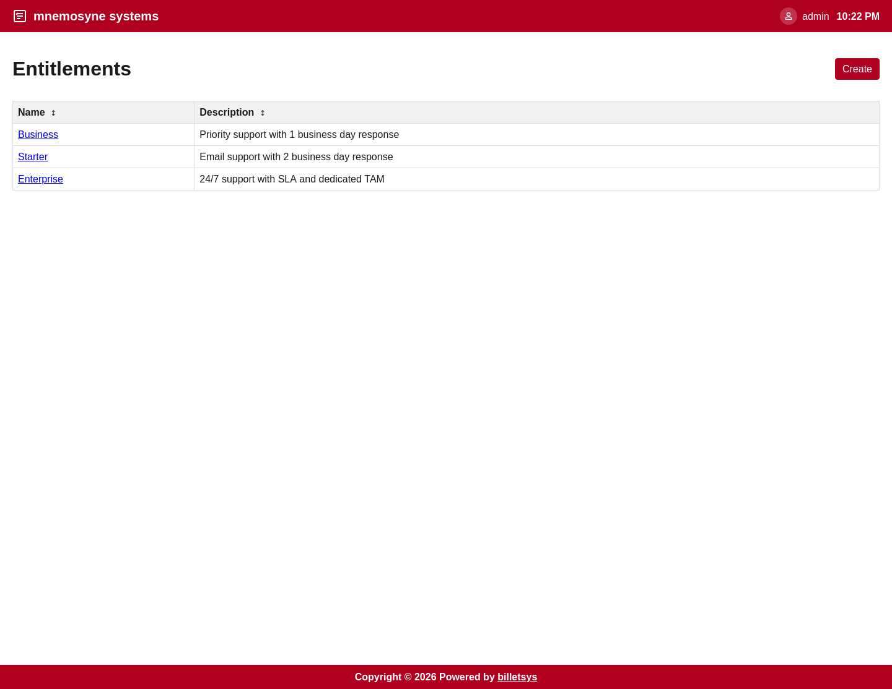

\newpage

# Entitlements

The **Entitlements** feature represents the service relationship that connects a company to the support offering it has in billetsys.

## Purpose

Support work is not only about the ticket itself. It also depends on what kind of service relationship exists for the customer. Entitlements provide that context.

They help express what support offering applies to a company and how that offering connects to versions, levels, and ticket handling.

## Service structure

Entitlements give billetsys a structured way to describe support arrangements. In practice, they help connect several important pieces:

* The customer company
* The support offering
* Support level information
* Version context
* Ticket eligibility and service scope

This allows the application to represent support not just as ad hoc case handling, but as part of a defined customer relationship.

## Company connection

Entitlements are especially important at the company level. They help determine which service context is available for a customer and which support relationship applies when tickets are created.

That means entitlements are part of how billetsys connects customer organizations with the services they receive.

## Ticket context

When tickets are created, entitlement information provides additional business and operational context. This helps ensure that ticket handling is understood in relation to the service agreement behind the case.

This is useful for both customer coordination and internal support planning.

## Levels and versions

Entitlements also connect naturally to support levels and version information. This allows billetsys to reflect not only that a service exists, but also what form it takes and what product context it applies to.

This relationship makes entitlements an important bridge between account management and technical support workflows.

## Operational value

Over time, entitlements help teams answer questions such as:

* What support arrangement applies to this customer
* Which service context belongs to a ticket
* How support offerings differ across companies

This makes entitlements one of the key concepts behind consistent service-aware ticket handling.

## Role perspective

Entitlements are mainly configured and maintained by administrative roles, but their effects are visible throughout the application. Support roles, superusers, TAMs, and ticket creators all benefit from having a clear service context behind the cases they work with.
