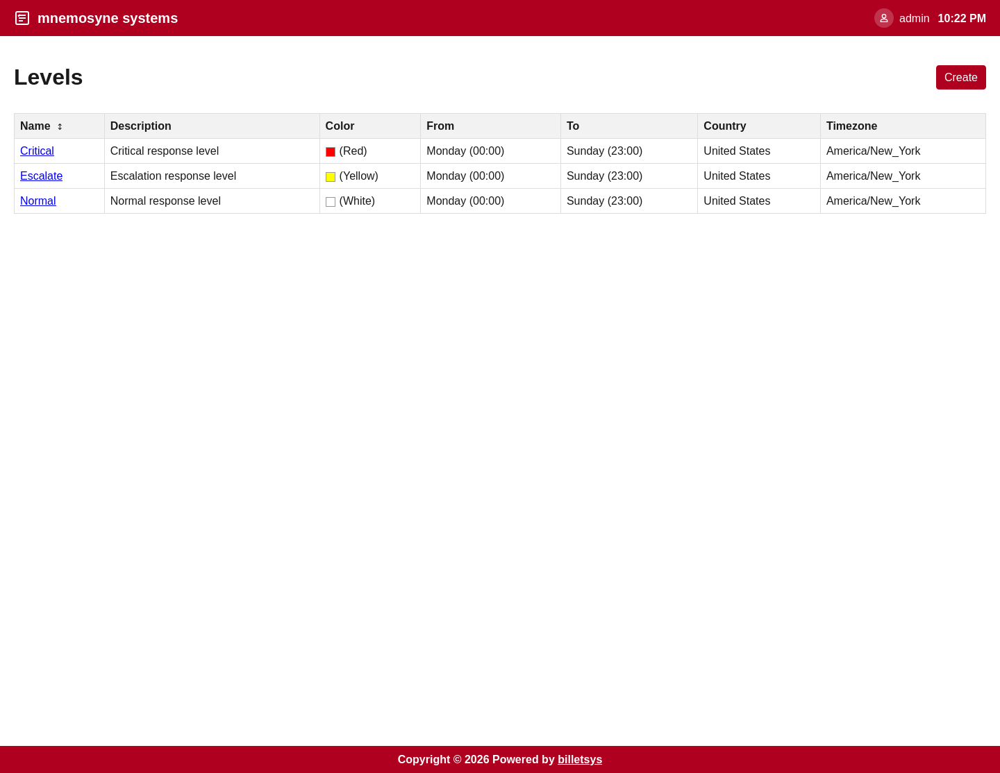

\newpage

# Levels

The **Levels** feature defines support tiers and service expectations that can be used throughout billetsys.

## Purpose

Not every support relationship operates under the same urgency or time expectations. Levels provide a structured way to describe those differences.

This makes it possible for billetsys to represent support context with more precision than a ticket status alone can provide.

## Service tiers

Levels are used to express support priority and service structure. They help describe how a support offering should be understood in practice.

Typical distinctions might include:

* Higher-priority support
* Standard support
* Escalation-oriented handling
* Region-specific or time-specific coverage

The exact meaning depends on how the organization configures the system.

## Time window context

Levels are also important because they can reflect support windows rather than only labels. This gives billetsys a way to represent service expectations in relation to time, schedule, and operational coverage.

That makes the feature useful for organizations that need more than a single generic support definition.

## Visual clarity

Levels can also help with visibility in the interface. A clear level model makes it easier for users and support teams to understand the service context attached to a company or ticket-related workflow.

## Connection to entitlements

Levels do not usually stand alone. They work together with entitlements to define how support is offered and understood for a customer.

This relationship makes levels an important part of the broader service model behind billetsys.

## Operational value

Over time, levels help teams answer questions such as:

* What service tier applies here
* How urgent the support context is
* How service expectations differ across customers

This makes the levels feature an important part of making support handling more structured and transparent.
