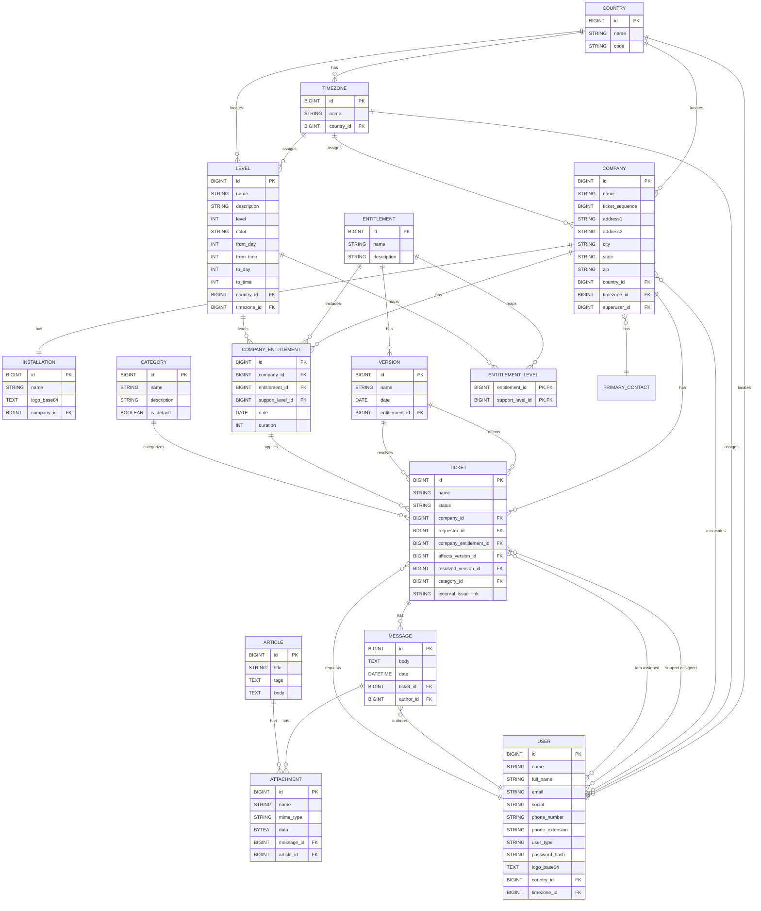

\newpage

# Architecture

## Backend

[**billetsys**](https://github.com/mnemosyne-systems/billetsys) is built on [Java](https://en.wikipedia.org/wiki/Java_(programming_language)) 25
and [Quarkus](https://quarkus.io/) 3.33 using [PostgreSQL](https://www.postgresql.org/) as the database.

The data model is defined in `model/` using JPA entities backed by [Hibernate ORM Panache](https://quarkus.io/guides/hibernate-orm-panache).

HTTP endpoints are handled in `resource/` using JAX-RS via [RESTEasy](https://resteasy.dev/).

Business logic is handled in `service/`. PDF generation is handled in `PdfService` and email notifications are handled in `TicketEmailService` using [Quarkus Mailer](https://quarkus.io/guides/mailer).

Shared helpers are defined in `util/`. Session management is handled in `AuthHelper` and file uploads are handled in `AttachmentHelper`.

Infrastructure concerns such as exception mappers and Markdown template extensions are defined in `infra/`.

Application startup and database seeding is handled in `init/` by `AppSeeder`.

## Frontend

The frontend uses [Qute](https://quarkus.io/guides/qute) server-side templates located under `src/main/resources/templates/`.

Role-specific views are organized under `admin/`, `support/`, `superuser/`, and `user/`.

Shared templates for tickets, messages, articles, and other resources are organized by feature.

Report charts are handled by [Chart.js][chartjs] and code highlighting in articles is handled by [highlight.js][highlightjs].

## Entity Model

[chartjs]: https://www.chartjs.org/
[highlightjs]: https://highlightjs.org/
